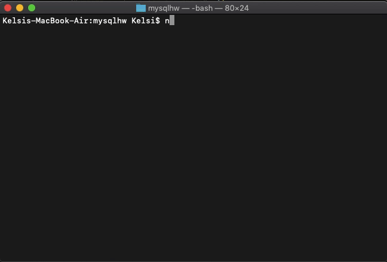

# "Bamazon" Shopping

Bamazon is a command line app where the user interacts with items in the Bamazon database.

## Bamazon Customer

To shop, the user enters: `node bamazonCustomer`. A menu appears where the user has the ability to either view all of the items for sale, view items in each department, or exit.

* If `View All Items` is selected, each item listed in the `products` table of the `bamazon_db` are listed along with the price. When the user selects an item, the `item_id` is then returned in order to run a query.
* After, an inquirer prompt is then displayed to ask the quantity to purchase.
* If there is enough quantity in stock, then the purchase is made.
* The database is updated to reflect the change in quantity and total sales for the product purched.

* If `View By Department` is selected, then only the items in department that the user chooses is displayed. The buying process is the same.

 

## Bamazon Manager

## Bamazon Supervisor

### Technologies

JavaScript, SQL, mySQL node module, and Inquirer node module.

#### Created by Kelsi Hoyle